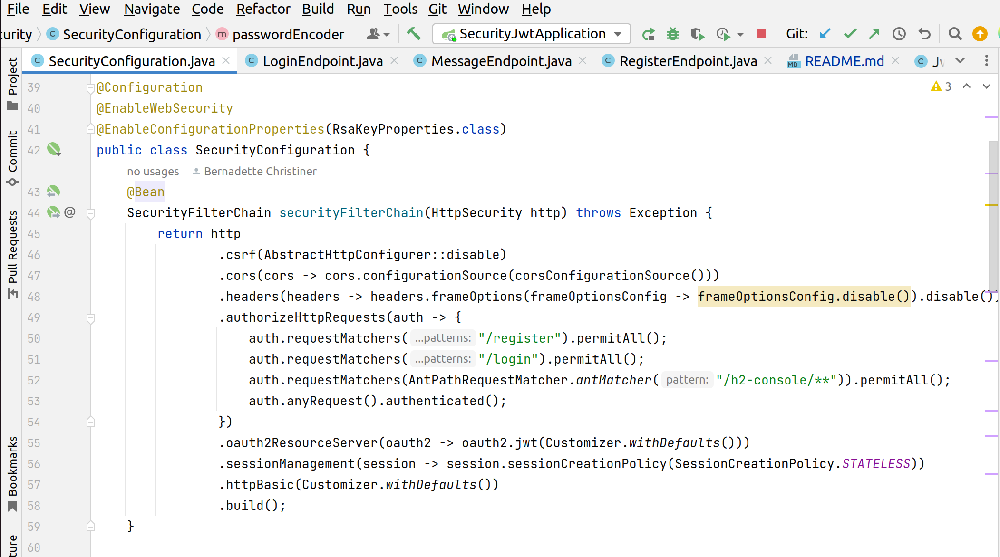
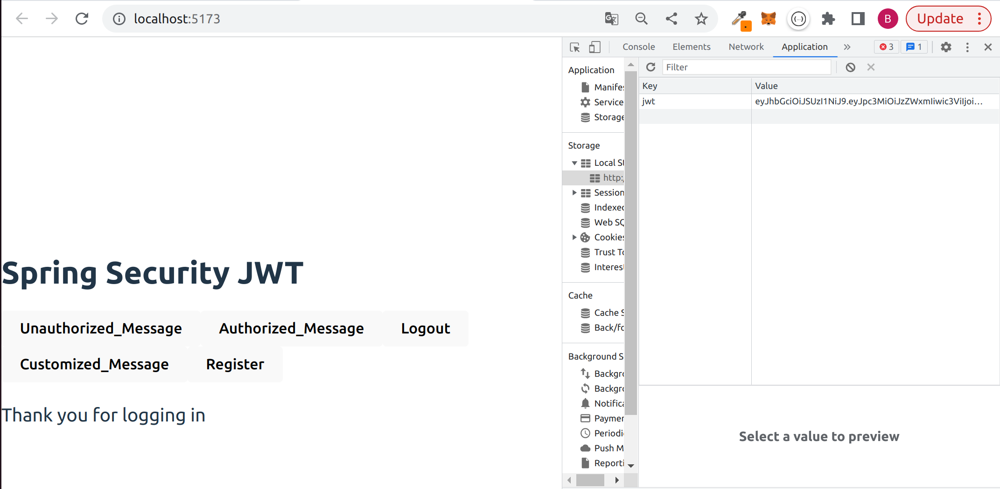
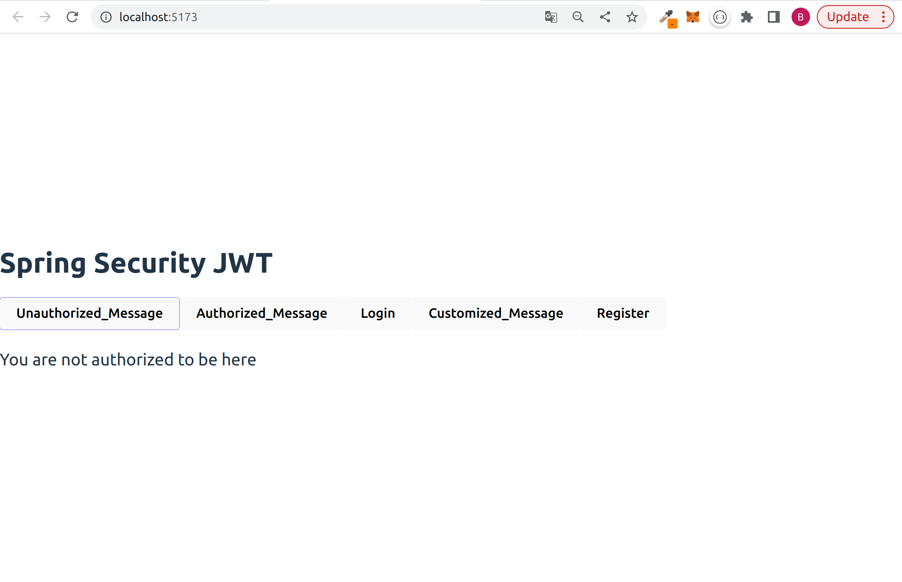

# SpringSecurity_PETProject

## About
This project is about Spring Security. 
Built with Java, Spring Web, Spring Security, React 

## CodeSnippet

SecurityFilterChain:

As soon as the user registers and logs in, 
a jason web token is stored in localstorage

In the case of unauthorized areas of the site, 
the user will be informed immediately.

